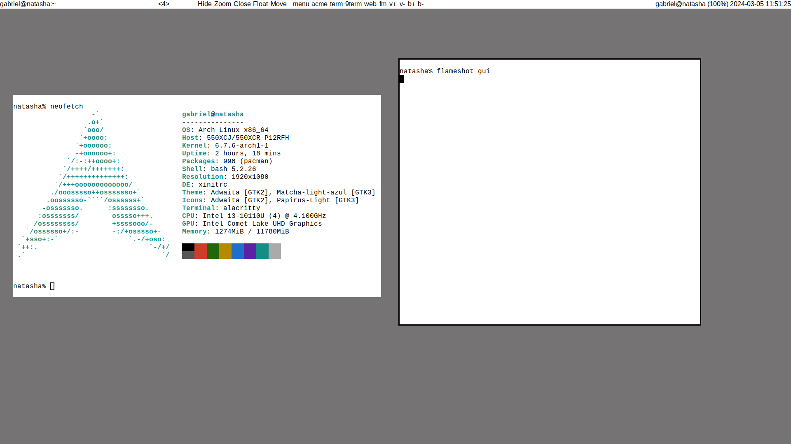

# Tibaji

Mouse-oriented tilling window manager for X11, inspired by the acme text editor.

It manages windows in a "master-stack" layout, similar to
[dwm](https://dwm.suckless.org/). Workspaces are added dynamically, just
like the GNOME desktop environment. This means that the last workspace is always
empty. It's click-to-type.

It's possible to put windows in floating mode and hide windows.

## Obligatory screenshot

## Usage

The bar has four sections:  
- The first one shows the current window name. Clicking on it will show all
  hidden windows. Clicking on a window name unhides it.  
- The second shows the number of workspaces and if it's possible to switch to
  the left or right. Clicking with the left button will switch to the left, and
  clicking with the right button switches to the right.  
- The third shows commands, which are runnable by clicking on them. The first 5
  are built-in, and the other ones are customizable in `config.h`.  
- The last shows the root window name, so it's possible to use programs like
  `slstatus` as statusbar.  

The `Hide` command works as expected. The `Zoom` puts the window in the master
position. `Close` closes the window. `Float` puts the window in the floating
layer if it's tilling, or returns it to tilling.

The `Move` command only works with floating windows. It warps the pointer to the
center of the window, and moves it with the cursor. Clicking with the right
button will switch to resize-mode and warps the pointer to the bottom-right
corner of the window (or switches back if already in resize mode). Clicking with
the left button finishes the operation.

## Build

Tibaji depends on Xlib and Xft.

## Name

This is my third X11 window manager iteration, and the second good one. My
previous good iteration is [Iguassu](https://github.com/gboncoffee/iguassu), a
rio clone. Iguassu is named after a river in the [Paraná
state](https://en.wikipedia.org/wiki/Paran%C3%A1_(state)), so I decided to name
Tibaji after another river there.
